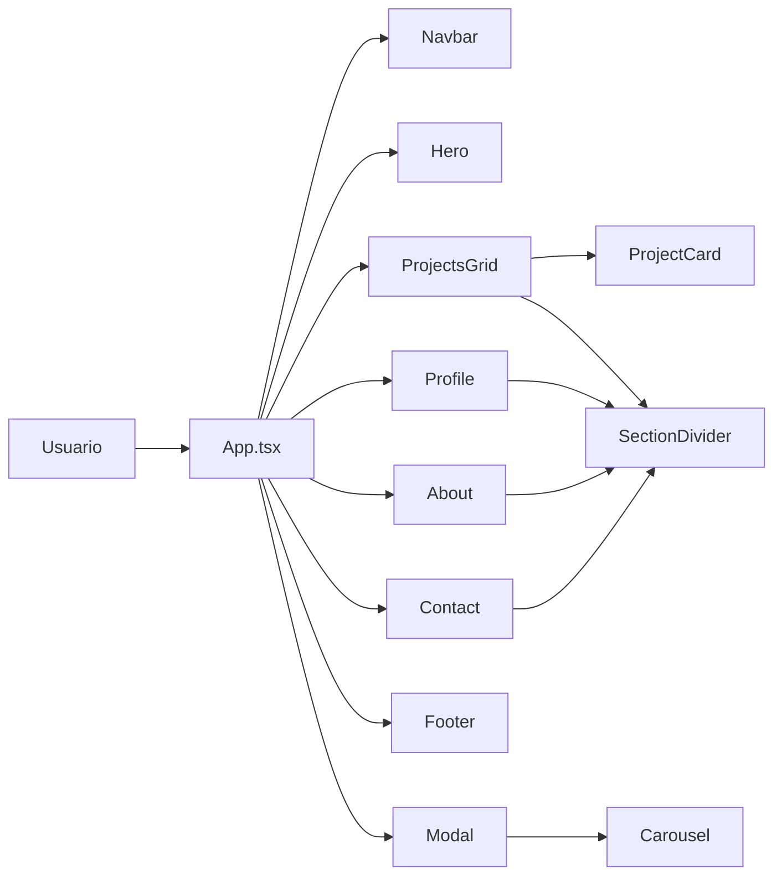

# Rodrigo Riffo — Portfolio

### Fullstack Developer especializado en backend. Construyo sistemas robustos y escalables que resuelven problemas reales.

**Portfolio personal** donde muestro mi trabajo como desarrollador fullstack con enfoque en backend. Cada proyecto aquí representa un caso de estudio completo con arquitectura documentada, diagramas y detalles técnicos.

> Este portfolio está construido con **React 19**, **TypeScript** y **Vite**, desplegado en **GitHub Pages** con integración continua.

---

## Tabla de Contenidos

- [Proyectos Destacados](#proyectos-destacados)
- [Arquitectura del Portfolio](#arquitectura-del-portfolio)
- [Características Técnicas](#características-técnicas)
- [Tecnologías Utilizadas](#tecnologías-utilizadas)
- [Cómo Ejecutar el Proyecto](#cómo-ejecutar-el-proyecto)
- [Estructura del Proyecto](#estructura-del-proyecto)
- [Deploy](#deploy)

---

## Proyectos Destacados

### 🛒 CastellanStore — E-commerce full stack

Plataforma de comercio electrónico construida con **MongoDB, Express, React y Node.js**. Implementa carrito de compras, autenticación de usuarios, catálogo de productos y panel de administración.

### ⏰ Sincro — Gestión de turnos, ausencias y planificación operativa

Plataforma full stack para la administración de equipos con trazabilidad, alcance por rol y notificaciones en tiempo real. Backend modular con **17 módulos**, **649 tests** y **80+ endpoints REST**.

### 📦 OmniStock — SaaS de inventario B2B

Plataforma de gestión de inventario multi-tenant con **Spring Boot, MariaDB y Redis**. Implementa caché distribuida, sincronización en tiempo real y reportes exportables.

### 🐾 AnimalWatch — Gestión de protectoras de animales

Sistema para la gestión de protectoras con **Spring Boot, MySQL y MinIO** para almacenamiento de imágenes. Incluye gestión de animales, adopciones, donaciones y voluntarios.

---

## Arquitectura del Portfolio

El portfolio sigue una arquitectura SPA (Single Page Application) con secciones modulares y carga diferida.



### Flujo de datos

```
JSON (studycases/[project]/[project].json)
  → src/data/projects.ts (importación centralizada)
    → App.tsx (estado global con useModal)
      → ProjectsGrid → ProjectCard
      → Modal → Carousel
```

### Principios aplicados

- **Componentes modulares**: Cada sección es un componente independiente con sus propios estilos
- **Lazy loading**: Los componentes fuera del viewport inicial se cargan bajo demanda con `React.lazy`
- **Custom hooks**: La lógica reutilizable (reveal, modal, carrusel) está encapsulada en hooks
- **Datos desacoplados**: Los proyectos viven en archivos JSON independientes, no en el código
- **Design tokens**: Colores y valores compartidos centralizados en `tokens.ts`

---

## Características Técnicas

### ⚡ Rendimiento

- **Lazy loading** con `React.lazy` + `Suspense` para secciones fuera del viewport inicial
- **Google Fonts** cargadas con `media="print"` + `onload` para evitar render-blocking
- **Animaciones con IntersectionObserver**: Solo se activan cuando el elemento entra en viewport
- **Sourcemaps desactivados** en build de producción

### 🎨 UI/UX

- **Navegación smooth-scroll** con IntersectionObserver para sección activa
- **Animaciones** con CSS keyframes y transiciones cubic-bezier
- **Modal** con carrusel de imágenes y diagramas de arquitectura
- **Custom cursor** con efecto "VER" en tarjetas de proyecto
- **Responsive** con breakpoint mobile (768px)
- **Reduced motion** soportado via `prefers-reduced-motion`

### ♿ Accesibilidad

- **Skip-to-content link** para navegación por teclado
- **ARIA labels** en componentes interactivos
- **Soporte de teclado** en modal (Escape para cerrar, flechas en carrusel)
- **Roles ARIA** en elementos interactivos

### 🛡️ Calidad

- **Error Boundary** con UI amigable y detalle técnico en desarrollo
- **TypeScript estricto** en toda la codebase
- **ESLint** con reglas de React y TypeScript

### 🔍 SEO

- **Meta tags**: description, keywords, author
- **Open Graph** para compartir en redes sociales
- **Twitter Cards** para preview en X/Twitter
- **404.html** para SPA routing en GitHub Pages

---

## Tecnologías Utilizadas

### Frontend

| Tecnología | Versión | Propósito |
|------------|---------|-----------|
| React | 19 | UI components |
| TypeScript | 6 | Tipado estático |
| Vite | 8 | Build tool |
| CSS3 | — | Estilos globales y animaciones |

### Infraestructura

| Tecnología | Propósito |
|------------|-----------|
| GitHub Pages | Hosting |
| GitHub Actions | CI/CD |
| gh-pages | Deploy manual |

---

## Cómo Ejecutar el Proyecto

### Requisitos

- Node.js 20+
- npm

### Instalación

```bash
# Clonar el repositorio
git clone https://github.com/RdrgRffo/Portfolio.git
cd Portfolio

# Instalar dependencias
npm install

# Iniciar servidor de desarrollo
npm run dev
```

Abrir [http://localhost:5173](http://localhost:5173) en el navegador.

### Comandos disponibles

| Comando | Descripción |
|---------|-------------|
| `npm run dev` | Servidor de desarrollo con HMR |
| `npm run build` | Build de producción |
| `npm run preview` | Previsualizar build local |
| `npm run lint` | Verificar código con ESLint |
| `npm run deploy` | Deploy manual a GitHub Pages |

---

## Estructura del Proyecto

```text
.
├── public/
│   ├── favicon.svg
│   ├── 404.html
│   └── studycases/
│       ├── castellanstore/
│       ├── sincro/
│       ├── omnistock/
│       └── animalwatch/
├── src/
│   ├── assets/
│   ├── components/
│   │   ├── Navbar.tsx
│   │   ├── Hero.tsx
│   │   ├── ProjectsGrid.tsx
│   │   ├── ProjectCard.tsx
│   │   ├── Modal.tsx
│   │   ├── Carousel.tsx
│   │   ├── Profile.tsx
│   │   ├── About.tsx
│   │   ├── Contact.tsx
│   │   ├── Footer.tsx
│   │   ├── CustomCursor.tsx
│   │   ├── SectionDivider.tsx
│   │   └── ErrorBoundary.tsx
│   ├── data/
│   │   ├── projects.ts
│   │   └── studycases/
│   │       ├── castellanstore/castellanstore.json
│   │       ├── sincro/sincro.json
│   │       ├── omnistock/omnistock.json
│   │       └── animalwatch/animalwatch.json
│   ├── hooks/
│   │   ├── useReveal.ts
│   │   ├── useModal.ts
│   │   ├── useCarousel.ts
│   │   └── useScrollLock.ts
│   ├── tokens.ts
│   ├── types.ts
│   ├── App.tsx
│   ├── main.tsx
│   └── index.css
├── .github/workflows/deploy.yml
├── .env.example
├── vite.config.js
├── tsconfig.json
├── package.json
└── README.md
```

---

## Deploy

### Automático (recomendado)

El deploy a GitHub Pages se realiza automáticamente mediante **GitHub Actions** cada vez que se hace push a la rama `main`.

El workflow:
1. Checkout del repositorio
2. Instalación de dependencias con `npm ci`
3. Build de producción con `npm run build`
4. Upload del directorio `dist` como artifact
5. Deploy a GitHub Pages

### Manual

```bash
npm run deploy
```

Esto ejecuta `npm run build` y luego publica el directorio `dist` en la rama `gh-pages`.

### SPA Routing

El archivo `public/404.html` redirige todas las rutas no encontradas a la raíz del portfolio, permitiendo que React Router funcione correctamente en GitHub Pages.

---

## Licencia

MIT
